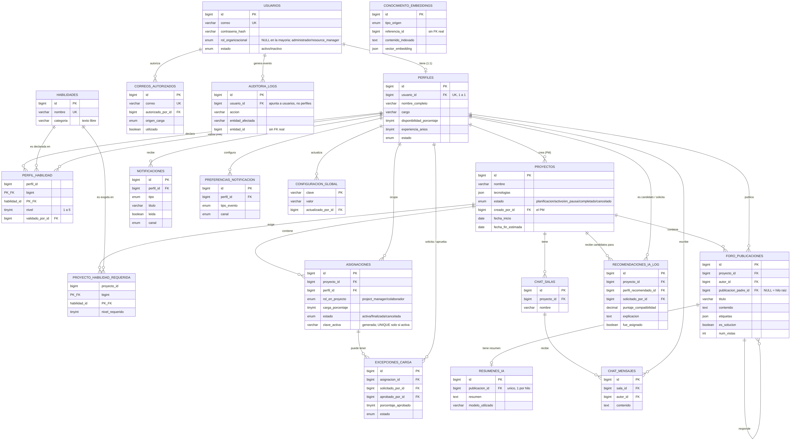

# 1. Alcance de este entregable y por qué existe una v2

El cronograma del curso fija el Entregable 2 (cierre: jueves 3 de septiembre
de 2026) en dos frentes: tener el modelo de base de datos definido y
funcionando, y tener la aplicación Spring Boot desplegada en la nube
conectada a esa base de datos.

Este documento reemplaza la versión anterior del informe. La primera versión
del modelo se había derivado de las 36 pantallas de mockup del proyecto. Tras
esa entrega, apareció **"SkillBridge AI 1.pdf"**: un documento de diseño de
base de datos de 21 páginas que refleja **feedback directo del jefe de
práctica**, con decisiones ya tomadas sobre puntos que en la v1 quedaban como
supuestos propios (separación usuarios/perfiles, modelo de roles, manejo de
historial de asignaciones, uso de MySQL con ENUM nativo, etc.).

Como ese documento es la fuente más autorizada disponible (revisión directa
del curso, no una inferencia hecha a partir de pantallas), **se usó como base
principal y se reescribió el esquema completo** en vez de solo agregarle
cosas encima a la v1. Donde la v1 tenía algo útil que el documento del JP no
cubre (excepciones de carga, notificaciones, configuración global), se
conservó como una extensión declarada explícitamente — nunca mezclada en
silencio con lo que pide el documento fuente.

Las tres piezas que sustentan el entregable:

1. El modelo entidad-relación completo (19 tablas), derivado del documento
   del jefe de práctica y de los RF01–RF13 del proyecto.
2. El script `schema.sql`, verificado ejecutándolo contra un motor
   MySQL/MariaDB real, incluyendo una prueba dirigida del mecanismo más
   delicado del diseño (el historial de roles por proyecto, ver sección 5).
3. Un proyecto Spring Boot (`backend/`) con las **19 entidades JPA completas**
   (una por tabla), listo para desplegarse en Google Cloud (Cloud SQL + Cloud
   Run), con la guía de despliegue paso a paso en `backend/README.md`.

# 2. El cambio central: de "un rol por usuario" a "usuarios + perfiles"

La v1 modelaba el rol como un solo campo enum en la tabla `usuario`
(Colaborador / Project Manager / Resource Manager / Administrador). El
documento del jefe de práctica separa esto en dos conceptos distintos, y esa
separación es la razón de fondo por la que hubo que reescribir el esquema en
vez de solo ampliarlo:

- **`usuarios`** — solo autenticación (correo, contraseña). Tiene un campo
  `rol_organizacional` (`administrador` | `resource_manager` | `NULL`) para
  los dos puestos que existen **por encima de cualquier proyecto en
  particular**: un Administrador o un Resource Manager lo son
  independientemente de en qué proyecto estén mirando en un momento dado.
- **`perfiles`** — datos de negocio (nombre, cargo, disponibilidad,
  biografía). Relación 1:1 con `usuarios`.
- **`asignaciones.rol_en_proyecto`** — el rol que una persona tiene *en un
  proyecto concreto*: `project_manager` o `colaborador`. Una misma persona
  puede ser PM en un proyecto y colaborador en otro; ese rol vive en la fila
  de asignación, no en el usuario.

Esto resuelve algo que la v1 no distinguía bien: "ser Resource Manager" es un
puesto organizacional fijo, mientras que "ser Project Manager de este
proyecto" es contextual y puede cambiar de proyecto a proyecto. Un Resource
Manager que además aporta como recurso en un proyecto puntual simplemente
tiene una fila en `asignaciones` con `rol_en_proyecto = 'colaborador'`, sin
que eso toque su `rol_organizacional`.

# 3. Diagrama entidad-relación



*(el archivo de origen a mayor resolución es `diagrama/er-diagram.png`,
incluido junto a este informe — ábranlo aparte para inspeccionar el detalle
de columnas y tipos de cada tabla con zoom).*

# 4. Las 19 tablas y su origen

| Tabla | Origen | Sustenta |
|---|---|---|
| `usuarios` | Documento JP | RF01 — login, `rol_organizacional` |
| `correos_autorizados` | Documento JP | RF01/RF02 — registro por lista blanca |
| `perfiles` | Documento JP | RF02 — datos de negocio de cada persona |
| `habilidades` | Documento JP | RF08 — catálogo |
| `perfil_habilidad` | Documento JP | RF02/RF08 — habilidad declarada por persona, nivel 1-5 |
| `proyectos` | Documento JP | RF03 |
| `proyecto_habilidad_requerida` | Documento JP | RF03, insumo de RF05 |
| `asignaciones` | Documento JP | RF03/RF04 — rol por proyecto + historial |
| `foro_publicaciones` | Documento JP (reemplaza `foro_categoria`/`hilo`/`mensaje` de la v1) | RF06 |
| `resumenes_ia` | Documento JP | RF06 — diferenciador de IA |
| `chat_salas`, `chat_mensajes` | Documento JP | RF07 |
| `auditoria_logs` | Documento JP | RF10 |
| `conocimiento_embeddings` | Documento JP | Búsqueda semántica, insumo de RF05 |
| `recomendaciones_ia_log` | Documento JP | RF05 — trazabilidad del AI Talent Matching |
| `excepciones_carga` | **Extensión propia** (viene de la v1) | RF04 — mockups muestran "Tomás Herrera (120%)... Solicitar excepción", el documento del JP no cubre este flujo |
| `notificaciones`, `preferencias_notificacion` | **Extensión propia** (viene de la v1) | RF09 — 3 pantallas de "Centro de notificaciones" en los mockups |
| `configuracion_global` | **Extensión propia** (viene de la v1) | RF08 — panel de Administrador, ~13 parámetros |

Nota sobre `matching_resultado` (v1): el documento del JP resuelve ese mismo
requisito con `recomendaciones_ia_log`, con más campos (explicación textual,
`fue_asignado` para medir qué tan bien funciona el matching en la práctica) —
se reemplazó, no se duplicó.

# 5. El mecanismo más delicado: historial de roles por proyecto

El documento del JP pide explícitamente poder **consultar información
histórica de proyectos** (quién fue PM antes, quién pasó por el proyecto)
sin permitir que dos filas activas choquen. La solución (la llama "Opción B"
el propio documento) es una columna generada:

```sql
clave_activa VARCHAR(41) GENERATED ALWAYS AS (
    CASE WHEN estado = 'activa'
         THEN CONCAT(proyecto_id, '-', perfil_id)
         ELSE NULL END
) STORED,
...
CONSTRAINT uq_asig_clave_activa UNIQUE (clave_activa)
```

MySQL permite múltiples valores `NULL` en una columna `UNIQUE`. Entonces:

- Mientras una asignación está `activa`, `clave_activa` vale
  `"<proyecto_id>-<perfil_id>"` y el `UNIQUE` bloquea una segunda fila activa
  de la misma persona en el mismo proyecto.
- Al finalizar o cancelar una asignación (`estado` distinto de `activa`),
  `clave_activa` pasa a `NULL` automáticamente y dejar de "ocupar" esa
  combinación — permitiendo que se cree una fila nueva (por ejemplo, la
  misma persona vuelve a ese proyecto más adelante) sin chocar con el
  historial.

**Esto no se dio por sentado: se probó en vivo.** Contra una instancia
MariaDB 10.11 real se insertó una asignación activa, se intentó insertar una
segunda fila activa para la misma persona/proyecto (rechazada por el
`UNIQUE`, como debía), se finalizó la primera (`UPDATE ... SET estado =
'finalizada'`) y se confirmó que `clave_activa` pasó a `NULL` y que
entonces sí se pudo insertar una nueva fila activa para esa combinación —
reproduciendo exactamente el comportamiento que describe el documento
fuente, no solo la lectura del DDL.

# 6. Otras decisiones de reconciliación

- **ENUM nativo de MySQL, no `VARCHAR` + `CHECK`.** La v1 usaba `VARCHAR` con
  `CHECK` pensando en portabilidad entre motores. El documento del JP
  especifica ENUM explícitamente y el proyecto ya está comprometido con
  MySQL (Cloud SQL), así que no hay razón para pagar el costo de legibilidad
  de `VARCHAR`+`CHECK` a cambio de una portabilidad que no se va a usar.
- **Nivel de habilidad 1-5, no las 4 etiquetas textuales de los mockups.**
  El documento del JP pide una escala numérica 1-5 (más fina, permite
  ordenar y promediar para el matching). Los mockups muestran
  Básico/Intermedio/Avanzado/Experto como etiqueta visual. Reconciliación:
  se guarda el número (fuente de verdad para el motor de matching) y la UI
  calcula la etiqueta a partir del número (ej. 1-2 → Básico, 3 → Intermedio,
  4 → Avanzado, 5 → Experto) — no se guardan ambas cosas por separado para
  no arriesgar que queden desincronizadas.
- **`vector_embedding` como `JSON`, no `pgvector`.** El documento fuente
  menciona `pgvector`, que es una extensión de **PostgreSQL**; este proyecto
  usa MySQL. Se guarda el vector como `JSON` (arreglo de números), tal como
  permite el propio documento como alternativa, y la similitud de coseno se
  calcula en la aplicación (fuerza bruta) en vez de con un índice nativo de
  vectores. Es viable para el volumen de datos de un curso. **Limitación
  declarada:** si el catálogo de contenido a indexar crece mucho, evaluar
  Vertex AI Vector Search o migrar esa tabla a un motor con soporte nativo
  (MySQL 9 HeatWave, o PostgreSQL + pgvector) — no es una decisión que haya
  que revisitar para este entregable, pero sí antes de escalar el producto.
- **`auditoria_logs.usuario_id` apunta a `usuarios`, no a `perfiles`** (a
  diferencia de todos los demás "quién hizo esto" del esquema, que apuntan a
  `perfiles`). Motivo: puede haber eventos de auditoría de sesión (ej. un
  intento de login fallido) antes de que exista o sin que exista un perfil
  de negocio completo asociado.
- **`excepciones_carga`, `notificaciones`, `preferencias_notificacion`,
  `configuracion_global` se mantienen de la v1**, adaptadas para apuntar a
  `perfiles` en vez de a `usuario` (ya no existe una tabla `usuario` con
  nombre — ahora son dos tablas). Se documentaron explícitamente en la
  sección 4 como extensión propia y no como parte del documento del JP, para
  que quede claro ante el jefe de práctica qué se agregó y por qué.

# 7. Backend Spring Boot

El proyecto `backend/` se reconstruyó completo para la v2:

- **19 entidades JPA + 19 repositorios Spring Data**, uno por tabla —
  reemplazan por completo las 9 entidades núcleo de la v1. Los dos casos con
  llave primaria compuesta (`perfil_habilidad`, `proyecto_habilidad_requerida`)
  usan `@EmbeddedId` + `@MapsId`. La columna generada `asignaciones.clave_activa`
  se mapea de solo lectura (`insertable = false, updatable = false`): nunca
  se setea desde Java, MySQL la calcula sola.
- **Conversores JPA para las columnas `JSON`**
  (`proyectos.tecnologias`, `foro_publicaciones.etiquetas`,
  `conocimiento_embeddings.vector_embedding`): se leen y escriben como
  `List<String>` / `List<Double>` normales desde el código de negocio, en
  vez de manipular JSON como texto.
- **`ProyectoService.crearProyecto(...)`**: soluciona en una sola
  transacción el problema que el propio documento del JP nombra
  explícitamente ("huevo y la gallina") — crear un proyecto sin dejarlo sin
  nadie formalmente asignado como PM. La transacción inserta el proyecto y,
  en la misma operación, la fila de `asignaciones` para su creador con
  `rol_en_proyecto = 'project_manager'`.
- **`RegistroService.registrar(...)`**: implementa el flujo de lista blanca
  de RF01/RF02 — valida que el correo exista en `correos_autorizados` con
  `utilizado = false`, crea `usuarios` + `perfiles`, hashea la contraseña
  con BCrypt, y marca el correo como usado, todo en una transacción (si algo
  falla, no queda un correo "gastado" sin usuario creado).
- **`GET /api/estado`**: ahora reporta conteos de `usuarios`, `perfiles`,
  `habilidades`, `proyectos` y `parametrosConfiguracion` — confirma que la
  app lee de la base de datos desplegada, no de datos en memoria.
- **`GET /actuator/health`**: expone el estado de la conexión JDBC.
- **`SecurityConfig`** sigue temporalmente en `permitAll` — RF01 completo
  (sesión, roles, CSRF) se implementa en el sprint del tema
  "Sesión, security" del curso; no desplegar esta versión de
  `SecurityConfig` más allá de este entregable.

# 8. Verificación realizada

No se dio por sentado que el script y el código "deberían" funcionar:

- **`schema.sql` se ejecutó contra una instancia MariaDB 10.11 real**: las
  19 tablas se crearon sin errores, se confirmaron las llaves foráneas
  activas, y se probó específicamente el mecanismo de historial de roles
  descrito en la sección 5 con inserts/updates reales (no solo revisión
  visual del DDL).
- **Cada entidad JPA se contrastó campo por campo contra `schema.sql`**:
  nombre de columna, columnas de las llaves foráneas, y valores de los
  `enum` de Java contra los `ENUM` nativos de MySQL — se verificó que los 12
  enums de Java usan exactamente los mismos literales (en minúscula) que sus
  `ENUM` de MySQL correspondientes, para que `@Enumerated(EnumType.STRING)`
  mapee 1:1 sin necesitar un `AttributeConverter` adicional.
- **Limitación honesta, sin cambios respecto a la v1:** en este entorno de
  trabajo no fue posible ejecutar `mvn clean package` porque la política de
  red del sandbox bloquea Maven Central (solo permite npm/PyPI/crates/Go, no
  repositorios Maven — se confirmó con una prueba directa de conexión, no es
  una suposición). El código sigue los patrones estándar de Spring Data JPA
  + Lombok + Jackson sin nada atípico, pero **antes de dar por cerrado el
  entregable, alguien del equipo debe correr `mvn clean package` en una
  máquina con acceso normal a internet** y avisar si sale algún error de
  compilación.

# 9. Pendiente para que el entregable quede 100% cerrado

1. Correr `mvn clean package` localmente (sección 8) y confirmar que
   compila — no se pudo verificar en este entorno por la política de red.
2. Seguir `backend/README.md` para crear la instancia de Cloud SQL, cargar
   `schema.sql` y desplegar en Cloud Run.
3. Reemplazar el hash de la contraseña del usuario administrador semilla
   (`schema.sql`, al final) antes de exponer el servicio públicamente.
4. Activar la alerta de presupuesto en GCP (comando incluido en el README)
   para no quedarse sin créditos antes de la sustentación final.
5. Llevar al jefe de práctica, para que quede confirmado por escrito y no
   solo inferido de este documento: la reconciliación del nivel de
   habilidad 1-5 contra las 4 etiquetas de los mockups (sección 6), y si las
   cuatro tablas marcadas como "extensión propia" en la sección 4
   (`excepciones_carga`, `notificaciones`, `preferencias_notificacion`,
   `configuracion_global`) deben mantenerse tal cual o el JP prefiere una
   forma distinta.
6. Si el proyecto ya tiene la plantilla propia del equipo disponible en
   algún repositorio compartido (no solo en un computador individual), fusionar
   este `backend/` con esa plantilla en vez de mantener dos bases de código
   en paralelo — ver la nota al inicio de `backend/README.md`.
